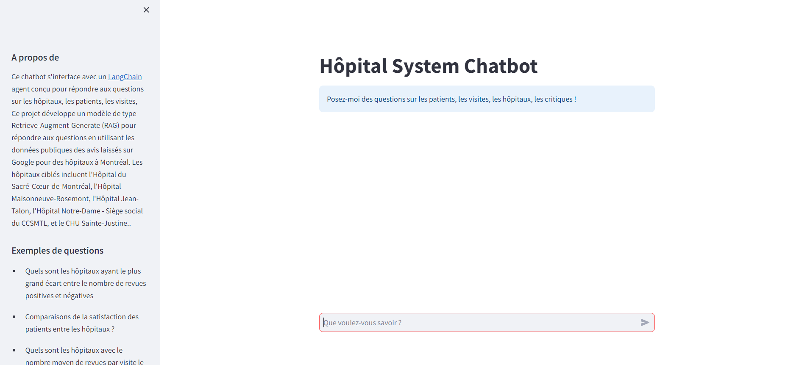
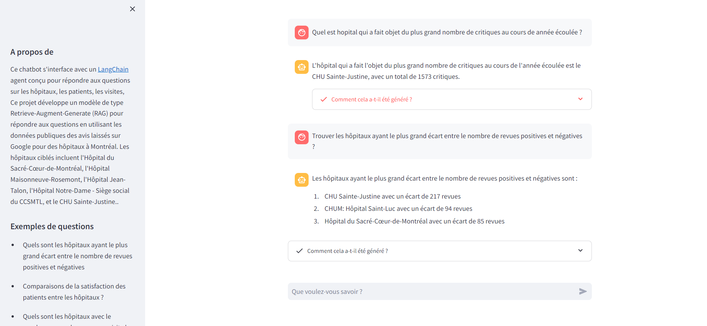

## Projet LLM RAG pour l'analyse des avis sur les hôpitaux Montréalais

*Figure 1: Interface principale de l'application - Home1*

*Figure 2: Interface secondaire de l'application - Home2*

## Description
Ce projet développe un modèle de type Retrieve-Augment-Generate (RAG) pour répondre aux questions en utilisant les données publiques des avis laissés sur Google pour des hôpitaux à Montréal. Les hôpitaux ciblés incluent l'Hôpital du Sacré-Cœur-de-Montréal, l'Hôpital Maisonneuve-Rosemont, l'Hôpital Jean-Talon, l'Hôpital Notre-Dame - Siège social du CCSMTL, et le CHU Sainte-Justine.

Il s'agit d'une démonstration d'IA générative. L'idée a été influencée par [cette étude](https://realpython.com/build-llm-rag-chatbot-with-langchain) menée par Harrison Hoffman, Pythonista, Data Scientist, et contributeur chez Real Python. Harrison Hoffman offre une excellente introduction au développement de modèles de type LLM (Large Language Models) avec LangChain en Python. Inspiré par cet exemple, j'ai adapté l'idée pour un cas d'utilisation réel.

## Objectifs
L'objectif principal est de fournir une visibilité immédiate sur les données en constante évolution des avis hospitaliers, sans nécessité de compétences en SQL ou attente de rapports analystiques.

## Comprendre le problème et les exigences
Imaginons que nous sommes des ingénieurs en IA développant une solution pour un grand réseau hospitalier. Nos parties prenantes nécessitent une visibilité accrue sur les données collectées, en souhaitant des réponses à des questions diverses concernant les patients, les visites, et le personnel, de manière simple et directe.

### Questions à Répondre
- Trouver les hôpitaux ayant le plus grand écart entre le nombre de revues positives et négatives.
- Comparaisons de la satisfaction des patients entre les hôpitaux.
- Feedback sur la communication du personnel soignant.
- Quels sont les hôpitaux avec le nombre moyen de revues par visite le plus élevé ?.
